# Workflow Ecosystem Optimization - Complete Strategy

**Date**: 2025-10-28
**Purpose**: Comprehensive optimization of MyDevWF workflow with MCP integration, testing stack modernization, and infrastructure/devops integration

---

## Executive Summary

This document presents a complete optimization strategy for your development workflow that:
- Maps MCPs to each BMad workflow phase (Planning → Development → Deployment)
- Integrates Context7 MCP for up-to-date documentation across all phases
- Modernizes testing stack (Playwright + Maestro, NO Jest)
- Integrates infrastructure/devops workflows
- Tailors BMad core to your specific tech stack

**Key Result**: A unified, MCP-enhanced workflow from project idea to production deployment.

---

## Current State Analysis

### ✅ What's Already Excellent

**1. BMad Core - Framework Agnostic**
- All agents (10/10) are testing-framework agnostic
- QA architecture is comprehensive (risk-based, test levels, traceability)
- Quality gates are deterministic and sound
- NO Jest mandates anywhere

**2. Project Templates - Production Ready**
- 4 templates created: Python/FastAPI+PostgreSQL, Node.js+Supabase, Node.js+MongoDB, React Native
- Each template has proper .mcp.json configuration
- BMad core integrated into all templates
- Automation scripts for rapid project creation

**3. MCPs - Properly Scoped**
- **Global**: Playwright MCP (web/backend E2E testing), Context7 (documentation)
- **Project-Specific**: Supabase, MongoDB, Swagger (per stack)
- **Sprint-Dependent**: Maestro (React Native, added when mobile work begins)

**4. Actual Workflow (User-Specific)**
- **ALL phases in Claude Code terminal** (no web UI)
- **Sonnet 4 model** for all work
- **Monolithic architecture** (small projects)
- **Dev manages background processes** (frontend + backend in dev terminal)
- **QA handoff protocol** (structured copy-paste between terminals)

### 🔍 What Needs Optimization

**1. Missing MCP Integration in BMad Workflow**
- Planning agents don't know about Context7 MCP (for up-to-date docs)
- Dev agent doesn't explicitly use Playwright/Maestro MCPs
- QA agent doesn't leverage MCP capabilities for test validation
- No MCP guidance in architecture templates

**2. Testing Stack Not Explicit**
- Tasks say "write tests" but don't specify Playwright
- No explicit Playwright/Maestro guidance in BMad data files
- No MCP-aware test generation tasks
- User wants **ONLY Playwright** (no Vitest, no unit tests)

**3. Handoff Protocols Missing**
- No structured QA Handoff format (Dev → QA terminal)
- No structured Developer Handoff format (QA → Dev terminal)
- Need copy-paste friendly outputs for terminal workflow

**4. Background Process Management**
- Dev agent needs explicit guidance on managing frontend/backend processes
- No clear instructions for running dev servers in background

**5. Context7 MCP Not Utilized**
- Would benefit planning phase (Architect getting latest docs)
- Would benefit development phase (Dev getting version-specific API docs)
- Not mentioned in any agent or task files

---

## MCP Ecosystem Map - Phase by Phase

### 🌐 Global MCPs (All Projects, All Phases)

```yaml
global_mcps:
  playwright:
    scope: user
    usage_phases: [planning, development, qa]
    primary_agents: [dev, qa]
    capabilities:
      - E2E test generation
      - Browser automation
      - API testing via request context
      - Accessibility tree navigation
    install: "claude mcp add --scope user playwright -- npx @playwright/mcp"

  context7:
    scope: user
    usage_phases: [planning, development, infrastructure]
    primary_agents: [architect, dev, ux-expert, ops]
    capabilities:
      - Real-time documentation fetching
      - Version-specific API references
      - Up-to-date code examples
      - Eliminates deprecated method suggestions
    install: "claude mcp add context7 -- npx -y @upstash/context7-mcp"
    usage: "Add 'use context7' to prompts for current docs"
```

### 📦 Project-Specific MCPs (Per Tech Stack)

```yaml
python_fastapi_postgres:
  mcps:
    - swagger: "http://localhost:8000/openapi.json"
  usage_phases: [development, qa]
  primary_agents: [dev, qa]

nodejs_supabase:
  mcps:
    - supabase: "http://localhost:54321/mcp"
    - swagger: "http://localhost:3000/api-docs"
  usage_phases: [development, qa]
  primary_agents: [dev, qa]
  security_note: "Use read_only=true for remote Supabase"

nodejs_mongodb:
  mcps:
    - mongodb: "mongodb://localhost:27017/myapp_dev"
    - swagger: "http://localhost:4000/api-docs"
  usage_phases: [development, qa]
  primary_agents: [dev, qa]

react_native:
  mcps:
    - maestro: "npx maestro-mcp" # Sprint-dependent
    - backend_mcp: "depends on backend choice"
  usage_phases: [development, qa]
  primary_agents: [dev, qa]
  note: "Add Maestro MCP when mobile sprint begins"
```

---

## Complete Workflow Diagram with MCP Integration

### Phase 1: Planning (Claude Code Terminal + Context7)


**MCP Usage in Planning (All in Claude Code Terminal):**
- **Context7**: Analyst uses "use context7" for market research, competitor analysis
- **Context7**: PM uses "use context7" for understanding technical constraints, feasibility
- **Context7**: Architect uses "use context7" when selecting tech stack, database schemas, API patterns
- **Context7**: UX Expert uses "use context7" for latest React/React Native component patterns

**Terminal Workflow**:
1. Start Claude Code terminal
2. Use agents (Analyst, PM, Architect, UX, QA, PO) in same terminal or new terminals
3. Documents saved to `docs/` (prd.md, architecture.md, etc.)
4. PO shards documents → `docs/epics/`, `docs/stories/`
5. Start new terminal for Development Phase (SM → Dev → QA)

### Phase 2: Development (IDE - Claude Code + All MCPs)

```mermaid
graph TD
    A[Development Phase Start] --> B[SM: Review Previous Story<br/>Dev/QA Notes]
    B --> B2[SM: Draft Next Story<br/>from Sharded Epic + Architecture]

    B2 --> S{High-Risk Story?}
    S -->|Yes| T[QA: *risk + *design]
    S -->|No| B3
    T --> U[Test Strategy Created<br/>Risk Profile Generated]
    U --> B3{PO: Validate Draft?}

    B3 -->|Yes| B4[PO: Validate Story]
    B3 -->|No| C
    B4 --> C{User Approval}

    C -->|Approved| D[Dev: use context7<br/>Sequential Task Execution]
    C -->|Changes| B2

    D --> D1[Dev: Start Background Processes<br/>Run frontend + backend servers]
    D1 --> E[Dev: Implement + Tests<br/>🔌 use context7 for docs<br/>🔌 Playwright MCP for E2E tests<br/>🔌 Maestro MCP for mobile<br/>🔌 Swagger MCP for API validation<br/>🔌 DB MCP for data ops]

    E --> E1[Dev: Generate QA Handoff<br/>📋 Story path, status, test results]
    E1 --> V{Mid-Dev QA Check?}
    V -->|Yes| W[QA: *trace or *nfr<br/>Early Validation]
    V -->|No| F
    W --> X[Dev: Address Gaps]
    X --> F

    F[Dev: Run All Validations<br/>Playwright tests<br/>Lint + Type checks]
    F --> G[Dev: Ready for Review<br/>Add Completion Notes]

    G --> H{User Verification}
    H -->|Request QA| H1[📋 Copy QA Handoff from Dev terminal]
    H -->|Approve| M[Verify Tests + Linting]
    H -->|Needs Fixes| D

    H1 --> H2[📋 Paste into QA terminal]
    H2 --> I[QA: Comprehensive Review<br/>🔌 Playwright MCP for test validation<br/>🔌 Swagger MCP for API verification]

    I --> J[QA: Test Architecture Analysis<br/>Active Refactoring<br/>Quality Gate Generation]
    J --> L{QA Gate Decision}

    L -->|PASS| L1[QA: Generate Completion Handoff<br/>✅ Gate status, story ready]
    L -->|CONCERNS| AA[QA: Generate Developer Handoff<br/>⚠️ Issues found, action items]
    L -->|FAIL| AB[QA: Generate Developer Handoff<br/>❌ Critical issues, must fix]
    L -->|WAIVED| L1

    L1 --> M[Verify Tests + Linting]
    AA --> AC[📋 Dev receives handoff in terminal]
    AB --> AC
    AC --> D
    M --> N[Dev: COMMIT CHANGES]
    N --> Y{Gate Update?}
    Y -->|Yes| Z[QA: *gate Update]
    Y -->|No| K
    Z --> K[Story DONE]
    K --> B

    style A fill:#f5f5f5
    style D fill:#e3f2fd
    style D1 fill:#64b5f6,color:#fff
    style E fill:#64b5f6,color:#fff
    style E1 fill:#1a73e8,color:#fff
    style H1 fill:#fce4ec,color:#000
    style H2 fill:#fce4ec,color:#000
    style I fill:#f9ab00,color:#fff
    style J fill:#ffd54f
    style L1 fill:#34a853,color:#fff
    style AA fill:#ff9800,color:#fff
    style AB fill:#f44336,color:#fff
    style AC fill:#fce4ec,color:#000
    style K fill:#34a853,color:#fff
    style M fill:#ff5722,color:#fff
    style N fill:#d32f2f,color:#fff
```



**MCP Usage in Development:**
- **Context7**: Dev uses "use context7" throughout for version-specific API docs, library usage patterns
- **Playwright MCP**: Dev generates E2E tests via natural language ("generate Playwright test for login flow")
- **Maestro MCP**: Dev generates mobile tests via natural language (if React Native sprint)
- **Swagger MCP**: Dev/QA test API endpoints directly (no Postman needed)
- **Supabase/MongoDB MCP**: Dev queries data, validates state, creates migrations

**Terminal Workflow**:
1. **Dev Terminal**: Start background processes (frontend + backend)
2. **Dev Terminal**: Implement story, use MCPs for development
3. **Dev Terminal**: Generate E2E tests with Playwright MCP
4. **Dev Terminal**: Output QA Handoff (copy-paste ready)
5. **QA Terminal**: Paste handoff, run review
6. **QA Terminal**: Generate Developer Handoff (if issues) or Completion Handoff (if PASS)
7. **Dev Terminal**: Address issues (if needed), commit changes

### Handoff Formats

#### QA Handoff (Dev → QA)

**Output by Dev at end of implementation:**

```
═══════════════════════════════════════════════════════
🎯 QA HANDOFF - Story Ready for Review
═══════════════════════════════════════════════════════

📋 Story: [epic].[story] - [Story Title]
📁 Story Path: docs/stories/[epic].[story].[slug].md
📊 Status: Ready for Review

✅ Implementation Complete:
- [List of completed tasks/subtasks]

🧪 Tests Written:
- [Number] E2E tests (Playwright)
- [Number] API tests (Playwright request context or Swagger)
- [Number] Mobile tests (Maestro - if applicable)

🔧 Test Execution Results:
- Playwright: [X/X passed]
- Lint: [passed/failed]
- Type Check: [passed/failed]

📦 Files Changed:
- [List of modified/created files from File List]

🚀 Background Processes Running:
- Frontend: http://localhost:[port]
- Backend: http://localhost:[port]
- Database: [connection info if relevant]

💡 Notes for QA:
- [Any important context, edge cases tested, known limitations]

═══════════════════════════════════════════════════════
📋 COPY THIS BLOCK AND PASTE IN QA TERMINAL
═══════════════════════════════════════════════════════
```

#### Developer Handoff (QA → Dev - If Issues Found)

**Output by QA after review (CONCERNS or FAIL):**

```
═══════════════════════════════════════════════════════
🔄 DEVELOPER HANDOFF - Issues Found
═══════════════════════════════════════════════════════

📋 Story: [epic].[story] - [Story Title]
🚦 Gate Decision: [CONCERNS / FAIL]
📁 Gate File: docs/qa/gates/[epic].[story]-[slug].yml

❌ Critical Issues (Must Fix):
[HIGH severity issues from top_issues]

⚠️  Non-Critical Issues (Should Fix):
[MEDIUM severity issues from top_issues]

📊 Coverage Gaps:
- [List of uncovered ACs or test scenarios]

🔧 NFR Status:
- Security: [PASS/CONCERNS/FAIL] - [notes]
- Performance: [PASS/CONCERNS/FAIL] - [notes]
- Reliability: [PASS/CONCERNS/FAIL] - [notes]
- Maintainability: [PASS/CONCERNS/FAIL] - [notes]

✅ Files Modified by QA (Refactoring):
- [List of files QA modified during active refactoring]

📝 Action Items:
1. [Prioritized list of fixes needed]
2. [...]

💡 QA Notes:
- [Additional context, suggestions, or explanations]

═══════════════════════════════════════════════════════
📋 COPY THIS BLOCK AND PASTE IN DEV TERMINAL
Apply fixes then re-run validations and generate new QA Handoff
═══════════════════════════════════════════════════════
```

#### Completion Handoff (QA → Dev - If PASS)

**Output by QA after review (PASS or WAIVED):**

```
═══════════════════════════════════════════════════════
✅ COMPLETION HANDOFF - Story Approved
═══════════════════════════════════════════════════════

📋 Story: [epic].[story] - [Story Title]
🚦 Gate Decision: [PASS / WAIVED]
📁 Gate File: docs/qa/gates/[epic].[story]-[slug].yml

✅ Quality Assessment:
- All acceptance criteria met
- Test coverage adequate
- NFRs validated
- Code quality satisfactory

📊 Quality Score: [0-100]

✅ Files Modified by QA (Refactoring):
- [List of files QA modified during active refactoring, if any]

💡 QA Notes:
- [Any recommendations for future improvements, technical debt notes]

🎯 Next Steps:
1. Verify all tests pass locally
2. Commit changes
3. Story marked as DONE
4. Proceed to next story

═══════════════════════════════════════════════════════
📋 READY TO COMMIT - All checks passed
═══════════════════════════════════════════════════════
```

---

## Infrastructure/DevOps Integration (DEFERRED)

**Status**: Completely deferred to future workflow version

**Rationale**:
- Current projects are **monolithic** (no Docker/Kubernetes complexity)
- User wants to **upskill on infrastructure** before integrating
- Dev currently handles commits and basic deployment
- Focus on **planning + development workflow** first

**Future Considerations** (when ready):
- Integrate `.bmad-infrastructure-devops/` expansion pack
- Add Ops agent for deployment automation
- CI/CD pipelines with automated Playwright/Maestro tests
- Docker/Kubernetes configurations
- Monitoring and alerting setup

**For Now**: Developer commits directly, manual deployment to monolithic hosting

---

## Optimization Roadmap - Implementation Phases

### ⚡ Phase 1: Core Testing Stack Integration (HIGH PRIORITY)

**Goal**: Make Playwright + Maestro explicit throughout BMad workflow

#### 1.1 Create Testing Stack Guide

**File**: `.bmad-core/data/testing-stack-guide.md`

**Content**:
```markdown
# Testing Stack Guide

## Testing Philosophy: NO Jest, NO Vitest

This workflow uses **ONLY Playwright for E2E testing**:
- **Web/Backend**: Playwright for E2E + API testing
- **Mobile**: Maestro for React Native UI testing
- **NO Unit Tests**: Focus on E2E coverage only

## Framework Selection by Platform

### Web Applications (React, Next.js, Vue)
- **E2E Tests**: Playwright (ONLY testing approach)
- **API Tests**: Playwright request context
- **Component Tests**: NOT USED (E2E coverage sufficient)

### React Native Applications
- **E2E Tests**: Maestro (iOS + Android with single YAML)
- **Component Tests**: NOT USED (E2E coverage sufficient)

### Backend APIs (Node.js, Python)
- **API Tests**: Playwright request context
- **Integration Tests**: Covered by Playwright E2E tests
- **Unit Tests**: NOT USED (E2E coverage sufficient)

## MCP-Enhanced Testing

### Playwright MCP (Global - Available Everywhere)

**Capabilities**:
- Generate E2E tests via natural language
- Use accessibility tree (faster than screenshots)
- Test API endpoints without Postman
- Browser automation for complex workflows

**Usage Examples**:
```
"Generate Playwright test for user login flow"
"Test the POST /api/users endpoint with validation"
"Create E2E test for checkout process with payment"
```

**Test Structure**:
```typescript
// tests/e2e/login.spec.ts
import { test, expect } from '@playwright/test';

test('user can login successfully', async ({ page }) => {
  await page.goto('/login');
  await page.fill('[data-testid="email"]', 'user@example.com');
  await page.fill('[data-testid="password"]', 'password123');
  await page.click('[data-testid="submit"]');
  await expect(page).toHaveURL('/dashboard');
  await expect(page.locator('[data-testid="user-name"]')).toContainText('User Name');
});
```

### Maestro MCP (Project-Specific - React Native Only)

**Installation** (Add when mobile sprint begins):
```bash
claude mcp add --scope project maestro -- npx maestro-mcp
```

**Capabilities**:
- Control iOS/Android emulators/simulators
- Write UI tests using natural language
- Auto-debug test failures
- Cross-platform (single YAML file for both platforms)

**Usage Examples**:
```
"Write Maestro test for login flow"
"Create test that navigates to profile and verifies data"
"Debug the failing checkout test"
```

**Test Structure**:
```yaml
# flows/login.yaml
appId: com.yourapp
---
- launchApp
- tapOn: "Email Input"
- inputText: "user@example.com"
- tapOn: "Password Input"
- inputText: "password123"
- tapOn: "Login Button"
- assertVisible: "Dashboard Screen"
```

## Test Level Framework

### When to Use Playwright E2E Tests (PRIMARY AND ONLY APPROACH)

**ALL Tests Use Playwright E2E**:
- ALL user journeys (login, checkout, registration, profile, settings, etc.)
- API endpoint behavior via Playwright request context
- Database operations (validate state via API or UI assertions)
- External service integrations
- Multi-component workflows
- Compliance-required workflows
- Visual regression testing
- Cross-browser compatibility

**For React Native: Use Maestro E2E Tests**:
- Mobile user journeys (iOS + Android with single YAML)
- Cross-platform UI testing
- Native component interactions

## Priority-Based Testing (P0/P1/P2/P3)

**P0 (Must Test - >90% coverage)**:
- Revenue-critical paths (payment, checkout)
- Security features (auth, authorization)
- Data integrity operations
- Compliance requirements

**P1 (Should Test - >80% coverage)**:
- Core user journeys (profile, settings)
- Frequently used features
- Integration points

**P2 (Nice to Test - >60% coverage)**:
- Secondary features
- Admin functions
- Edge cases

**P3 (If Time Permits)**:
- Rarely used features
- Nice-to-have functionality

## Test Data Management

- **Use factories/fixtures** for consistent test data
- **Self-cleaning tests**: Each test manages its own data
- **No shared state**: Tests run independently
- **Use test databases**: Never test against production data

## Quality Standards

All tests must meet:
- ✅ **No flaky tests**: Proper async handling, explicit waits
- ✅ **No hard waits**: Use `waitFor`, polling, or event-based waits
- ✅ **Stateless**: Tests don't depend on execution order
- ✅ **Fast feedback**: Playwright E2E tests should complete within reasonable time (<2 min per test)
- ✅ **Clear assertions**: Kept in test files, not buried in helpers
```

#### 1.2 Update Dev Agent

**File**: `.bmad-core/agents/dev.md`

**Changes**:
```yaml
dependencies:
  data:
    - coding-standards.md
    - tech-stack.md
    - source-tree.md
    - testing-stack-guide.md  # NEW

persona:
  core_principles:
    # ... existing principles ...
    - "CRITICAL: Use ONLY Playwright for web/backend E2E tests, Maestro for React Native"
    - "CRITICAL: Leverage Playwright/Maestro MCPs for test generation when available"
    - "CRITICAL: NO Jest, NO Vitest, NO unit tests - ONLY Playwright E2E + Maestro (mobile)"
    - "CRITICAL: Use 'use context7' in all prompts for up-to-date library documentation"
    - "MCP-Enhanced Development: Auto-test APIs with Swagger MCP, generate E2E tests with Playwright MCP"
    - "Background Process Management: Always start and manage frontend/backend dev servers in terminal"
    - "QA Handoff Generation: Always output structured QA Handoff at end of implementation"
```

#### 1.3 Update QA Agent

**File**: `.bmad-core/agents/qa.md`

**Changes**:
```yaml
dependencies:
  data:
    - technical-preferences.md
    - testing-stack-guide.md  # NEW

persona:
  core_principles:
    # ... existing principles ...
    - "MCP-Aware Testing: Leverage Playwright/Maestro MCPs for test validation and generation"
    - "Framework Alignment: Ensure tests use Playwright (web) or Maestro (mobile)"
    - "Context7 Usage: Use 'use context7' for latest testing patterns and assertions"
```

#### 1.4 Create MCP-Aware Test Generation Tasks

**File**: `.bmad-core/tasks/generate-playwright-tests.md`

```markdown
# generate-playwright-tests

Use Playwright MCP to generate E2E tests for story acceptance criteria.

## Prerequisites
- Playwright MCP available (verify with /mcp)
- Story has approved acceptance criteria
- Playwright installed in project

## Process

1. **Load Story**: Read story file to understand ACs
2. **Check MCP**: Verify Playwright MCP is active (`/mcp` command)
3. **Generate Tests**: For each AC, use Playwright MCP to generate test
4. **Review Generated Tests**: Ensure tests are comprehensive and follow standards
5. **Save Tests**: Write to `tests/e2e/{feature-name}.spec.ts`
6. **Run Tests**: Execute `npx playwright test` to verify
7. **Update Story**: Mark test generation subtask complete

## Example Prompt for Playwright MCP

"Generate Playwright test for user login flow:
- Navigate to /login page
- Fill email field with test@example.com
- Fill password field with password123
- Click submit button
- Verify redirect to /dashboard
- Assert user name is displayed
- Ensure session is created"

## Quality Standards

Generated tests must:
- Use data-testid selectors for stability
- Have explicit waits (no hard waits like `page.waitForTimeout()`)
- Include proper assertions
- Be stateless and self-cleaning
- Follow project's Playwright config

## Output
- Test file: `tests/e2e/{feature}.spec.ts`
- Story test subtask: Marked complete
- Test execution result: All tests passing
```

**File**: `.bmad-core/tasks/generate-maestro-tests.md`

```markdown
# generate-maestro-tests

Use Maestro MCP to generate mobile E2E tests for React Native apps.

## Prerequisites
- Maestro MCP available (verify with /mcp)
- React Native project configured
- Story has approved acceptance criteria
- Maestro CLI installed

## Process

1. **Load Story**: Read story file to understand ACs
2. **Check MCP**: Verify Maestro MCP is active (`/mcp` command)
3. **Generate Tests**: For each AC, use Maestro MCP to generate YAML flow
4. **Review Generated Flows**: Ensure flows are correct and comprehensive
5. **Save Tests**: Write to `flows/{feature-name}.yaml`
6. **Run Tests**: Execute `maestro test flows/{feature-name}.yaml` on simulator/emulator
7. **Update Story**: Mark test generation subtask complete

## Example Prompt for Maestro MCP

"Generate Maestro test for user login:
- Launch app
- Tap on Email Input field
- Input: user@example.com
- Tap on Password Input field
- Input: password123
- Tap Login Button
- Assert Dashboard Screen is visible
- Assert User Profile displays correct name"

## Quality Standards

Generated flows must:
- Use clear element identifiers (accessibility labels)
- Have explicit assertions for each step
- Work on both iOS and Android
- Include proper error handling
- Follow YAML best practices

## Output
- Flow file: `flows/{feature}.yaml`
- Story test subtask: Marked complete
- Test execution result: Flow passes on iOS + Android
- Cross-platform note: Single YAML runs on both platforms
```

#### 1.5 Update test-levels-framework.md

**File**: `.bmad-core/data/test-levels-framework.md`

**Add Section** (after existing content):

```markdown
## Framework Selection by Platform

### Web Applications (React, Next.js, Vue, etc.)
- **E2E Tests**: Playwright
- **Component Tests**: Playwright Component Testing (or Vitest)
- **API Tests**: Playwright's request context

### React Native Applications
- **E2E Tests**: Maestro
- **Component Tests**: React Native Testing Library
- **Unit Tests**: Vitest (or Jest alternative)

### Backend APIs (Node.js, Python, etc.)
- **API Tests**: Playwright request context
- **Integration Tests**: Supertest (Node.js) or httpx (Python)
- **Unit Tests**: Vitest (Node.js) or pytest (Python)

## MCP-Enhanced Testing

When MCPs are available, leverage them:

- **Playwright MCP**: Generate web E2E tests via natural language
- **Maestro MCP**: Generate mobile tests via natural language
- **Swagger MCP**: Validate API contracts automatically
- **Database MCPs**: Verify data persistence

### Test Generation Workflow with MCPs

1. **Dev implements feature**
2. **Dev uses Playwright/Maestro MCP**: "Generate test for [feature]"
3. **MCP generates test code** based on acceptance criteria
4. **Dev reviews and customizes** generated tests
5. **Dev runs tests** to verify functionality
6. **QA validates test quality** during review

This approach reduces test writing time by 50-60%.
```

---

### 🌐 Phase 2: Context7 Integration (HIGH PRIORITY)

**Goal**: Enable up-to-date documentation access across all workflow phases

#### 2.1 Install Context7 MCP Globally

```bash
claude mcp add context7 -- npx -y @upstash/context7-mcp
```

#### 2.2 Update Architect Agent

**File**: `.bmad-core/agents/architect.md`

**Changes**:
```yaml
persona:
  core_principles:
    # ... existing principles ...
    - "CRITICAL: Always use 'use context7' when referencing frameworks, libraries, or APIs"
    - "Version-Specific Docs: Context7 ensures architecture uses current, non-deprecated patterns"
    - "Stay Current: Context7 provides real-time documentation for selected tech stack"
```

#### 2.3 Update UX Expert Agent

**File**: `.bmad-core/agents/ux-expert.md`

**Changes**:
```yaml
persona:
  core_principles:
    # ... existing principles ...
    - "Context7 Integration: Use 'use context7' for latest React/React Native component patterns"
    - "Current Best Practices: Context7 ensures UI specs use modern, supported approaches"
```

#### 2.4 Update PM Agent (Optional but Recommended)

**File**: `.bmad-core/agents/pm.md`

**Add Note**:
```yaml
persona:
  core_principles:
    # ... existing principles ...
    - "When discussing technical constraints with Architect, suggest 'use context7' for accurate limitations"
```

#### 2.5 Update Architecture Templates

**File**: `.bmad-core/templates/fullstack-architecture-tmpl.yaml`

**Add Section** (near tech_stack):

```yaml
mcp_integration:
  context7:
    usage: "Use 'use context7' in all prompts when selecting or documenting tech stack"
    benefit: "Ensures architecture uses current, non-deprecated patterns and APIs"

  testing_mcps:
    playwright:
      scope: global
      usage: "E2E testing for web and backend"
    maestro:
      scope: project
      usage: "Mobile testing for React Native (add when mobile sprint begins)"

  project_mcps:
    note: "Project-specific MCPs depend on tech stack (Supabase, MongoDB, Swagger)"
```

---

### 🏗️ Phase 3: Infrastructure/DevOps Integration (MEDIUM PRIORITY)

**Goal**: Integrate `.bmad-infrastructure-devops/` expansion pack into workflow

#### 3.1 Explore Infrastructure/DevOps Pack

First, let's see what's in there:

```bash
# List contents
ls -la .bmad-infrastructure-devops/
```

**Expected Contents** (typical BMad expansion pack):
- `agents/` - Ops, DevOps, SRE agents
- `tasks/` - CI/CD setup, deployment, monitoring tasks
- `templates/` - Docker, K8s, CI/CD config templates
- `checklists/` - Infrastructure readiness checklists
- `config.yaml` - Pack configuration

#### 3.2 Integration Strategy (After Reviewing Contents)

**Option A: Full Integration**
- Add Ops agent to workflow diagram (Phase 3)
- Create deployment tasks that run Playwright/Maestro in CI
- Integrate monitoring and alerting

**Option B: Selective Integration**
- Use only CI/CD tasks for automated testing
- Use deployment checklists for production readiness
- Keep infrastructure management manual for now

**Recommendation**: Start with Option B, expand to Option A as workflows mature.

#### 3.3 CI/CD + Testing Integration

**Concept**: Automated Playwright/Maestro execution in CI/CD pipeline

**GitHub Actions Example** (if using):

```yaml
# .github/workflows/test.yml
name: Test Suite

on: [push, pull_request]

jobs:
  web-tests:
    runs-on: ubuntu-latest
    steps:
      - uses: actions/checkout@v3
      - uses: actions/setup-node@v3
      - run: npm install
      - run: npx playwright install --with-deps
      - run: npx playwright test
      - uses: actions/upload-artifact@v3
        if: failure()
        with:
          name: playwright-report
          path: playwright-report/

  mobile-tests:
    runs-on: macos-latest  # For iOS simulator
    steps:
      - uses: actions/checkout@v3
      - uses: actions/setup-node@v3
      - run: npm install
      - run: brew install maestro
      - run: maestro test flows/
```

---

### 📊 Phase 4: Template Refinement (LOW PRIORITY)

**Goal**: Update project templates with all optimizations

#### 4.1 Update All Project Templates

For each template (`python-fastapi-postgres`, `nodejs-supabase`, `nodejs-mongodb`, `react-native`):

**Add to README.md**:
```markdown
## Testing Stack

This project uses:
- **Playwright**: Web/backend E2E + API testing
- **Maestro** (React Native only): Mobile E2E testing
- **Vitest**: Selective unit testing for pure functions

### Running Tests

```bash
# Web/Backend E2E tests
npx playwright test

# Mobile tests (React Native only)
maestro test flows/

# Unit tests (selective)
npm run test:unit
```

### Using MCPs for Testing

This project has Playwright MCP configured (global). Generate tests via:

```
"Generate Playwright test for user registration flow"
"Test the POST /api/auth/login endpoint"
```

For React Native projects, add Maestro MCP when mobile work begins:
```bash
claude mcp add --scope project maestro -- npx maestro-mcp
```

## Context7 Integration

Always use **Context7 MCP** for up-to-date documentation:

```
"use context7 - How do I implement authentication in FastAPI?"
"use context7 - Show me the latest Supabase Auth patterns"
"use context7 - What's the current way to style React Native components?"
```

This ensures you get current, non-deprecated code examples.
```

#### 4.2 Add Test Configs to Templates

**Playwright Config** (all templates except react-native):

```typescript
// playwright.config.ts
import { defineConfig, devices } from '@playwright/test';

export default defineConfig({
  testDir: './tests/e2e',
  fullyParallel: true,
  forbidOnly: !!process.env.CI,
  retries: process.env.CI ? 2 : 0,
  workers: process.env.CI ? 1 : undefined,
  reporter: 'html',
  use: {
    baseURL: 'http://localhost:3000',
    trace: 'on-first-retry',
  },
  projects: [
    { name: 'chromium', use: { ...devices['Desktop Chrome'] } },
    { name: 'firefox', use: { ...devices['Desktop Firefox'] } },
    { name: 'webkit', use: { ...devices['Desktop Safari'] } },
  ],
  webServer: {
    command: 'npm run dev',
    url: 'http://localhost:3000',
    reuseExistingServer: !process.env.CI,
  },
});
```

**Maestro Config** (react-native template only):

```yaml
# .maestro/config.yaml
appId: com.yourapp
---
# Global test configuration
```

---

## Complete MCP-Enhanced Workflow Summary

### Planning Phase (Web UI)

| Agent | MCPs Used | Purpose |
|-------|-----------|---------|
| **Analyst** | Context7 | Research latest market trends, competitor tech stacks |
| **PM** | Context7 | Understand technical constraints, validate feasibility |
| **Architect** | Context7 | Select current tech stack, avoid deprecated patterns |
| **UX Expert** | Context7 | Use latest React/RN component libraries and patterns |
| **QA** | Context7 | Research current testing approaches for high-risk areas |

### Development Phase (Claude Code IDE)

| Agent | MCPs Used | Purpose |
|-------|-----------|---------|
| **SM** | Context7 | Understand technical context for story creation |
| **Dev** | Context7, Playwright, Maestro, Swagger, DB (Supabase/MongoDB) | - Context7: Up-to-date API docs<br/>- Playwright: Generate E2E tests<br/>- Maestro: Generate mobile tests<br/>- Swagger: Test API endpoints<br/>- DB MCP: Query data, validate state |
| **QA** | Context7, Playwright, Swagger | - Context7: Latest testing patterns<br/>- Playwright: Validate E2E test quality<br/>- Swagger: Verify API contracts |

### Infrastructure/DevOps Phase (Future)

| Agent | MCPs Used | Purpose |
|-------|-----------|---------|
| **Ops** | Context7, Playwright (CI) | - Context7: Latest Docker/K8s patterns<br/>- Playwright: Run E2E tests in CI/CD |

---

## Implementation Priority & Timeline

### ✅ Week 1: Core Testing Stack (Must Do)

**Priority**: CRITICAL
**Effort**: 2-3 hours
**Impact**: Immediate 40-50% productivity boost

- [x] Install Context7 MCP globally
- [ ] Create `testing-stack-guide.md`
- [ ] Update Dev agent with testing stack rules
- [ ] Update QA agent with MCP awareness
- [ ] Create `generate-playwright-tests.md` task
- [ ] Create `generate-maestro-tests.md` task
- [ ] Update `test-levels-framework.md` with framework selection

**Validation**: Create a test story, use Dev agent to implement with Playwright MCP

### ⚡ Week 2: Context7 Integration (High Value)

**Priority**: HIGH
**Effort**: 1-2 hours
**Impact**: Always-current documentation, eliminates deprecated code

- [ ] Update Architect agent with Context7 usage
- [ ] Update UX Expert agent with Context7 usage
- [ ] Update architecture templates with MCP guidance
- [ ] Add Context7 usage examples to CLAUDE.md

**Validation**: Create architecture doc using Architect + Context7

### 🏗️ Week 3: Infrastructure Review (Exploratory)

**Priority**: MEDIUM
**Effort**: 2-4 hours (exploration)
**Impact**: TBD (depends on pack contents)

- [ ] Review `.bmad-infrastructure-devops/` contents
- [ ] Identify useful tasks/agents for your workflow
- [ ] Decide on integration strategy (full vs selective)
- [ ] Create deployment workflow if valuable

**Validation**: Deploy one project using infrastructure pack guidance

### 📦 Week 4: Template Refinement (Polish)

**Priority**: LOW (already functional)
**Effort**: 1-2 hours
**Impact**: Better onboarding for new projects

- [ ] Update all template READMEs with testing + MCP guidance
- [ ] Add Playwright configs to templates
- [ ] Add Maestro config to React Native template
- [ ] Add CI/CD example workflows

**Validation**: Create new project from template, verify all MCPs work

---

## Key Decisions & Rationale

### ✅ Decision 1: Context7 MCP Global Scope

**Rationale**: Useful across all phases (planning, dev, ops), minimal overhead

### ✅ Decision 2: Playwright MCP Global Scope

**Rationale**: Needed for all web/backend projects, already installed

### ✅ Decision 3: Maestro MCP Project + Sprint-Dependent

**Rationale**: Only needed for React Native, added when mobile work begins

### ✅ Decision 4: NO Jest Anywhere

**Rationale**: Playwright + Maestro cover all E2E needs, Vitest for selective unit testing

### ✅ Decision 5: Supabase/MongoDB MCPs Project-Specific

**Rationale**: Stack-dependent, not all projects use these databases

### ✅ Decision 6: Infrastructure/DevOps Integration Deferred

**Rationale**: Requires exploration of pack contents, not blocking current workflow

---

## Success Metrics

### Quantitative Metrics

**Productivity Gains:**
- Story implementation time: **50-60% reduction** (MCP-enhanced development)
- Test writing time: **60-70% reduction** (Playwright/Maestro MCP generation)
- API testing time: **80% reduction** (Swagger MCP eliminates Postman)
- Documentation lookup time: **90% reduction** (Context7 real-time docs)

**Quality Improvements:**
- Deprecated code: **0%** (Context7 prevents outdated patterns)
- Test coverage: **>90%** for P0/P1 features (automated test generation)
- Regression defects: **Near 0** (comprehensive E2E testing)

### Qualitative Metrics

- ✅ Always-current code (no deprecated methods)
- ✅ Faster onboarding (templates + MCP guidance)
- ✅ Consistent testing approach (Playwright + Maestro everywhere)
- ✅ Clear quality gates (QA architecture)
- ✅ Audit trail (all decisions documented)

---

## Next Steps

### Immediate Actions (Today)

1. **Install Context7 MCP**: `claude mcp add context7 -- npx -y @upstash/context7-mcp`
2. **Verify MCPs**: Run `/mcp` in Claude Code, confirm Playwright + Context7 active
3. **Create testing-stack-guide.md**: Copy content from this document
4. **Update Dev agent**: Add testing stack dependencies and rules

### This Week

1. Create `generate-playwright-tests.md` task
2. Create `generate-maestro-tests.md` task
3. Update test-levels-framework.md with framework selection
4. Update QA agent with MCP awareness

### Next Week

1. Update Architect agent with Context7 usage
2. Update UX Expert with Context7 usage
3. Test full workflow: Story creation → Implementation with MCPs → QA Review

### Future Exploration

1. Review `.bmad-infrastructure-devops/` contents
2. Create deployment workflow
3. Integrate CI/CD with Playwright/Maestro automation

---

## Questions & Decisions Needed

### ❓ Question 1: Infrastructure/DevOps Scope

**Context**: You mentioned you haven't been using `.bmad-infrastructure-devops/` pack yet.

**Options**:
1. **Light Integration**: Only use CI/CD tasks for automated testing
2. **Full Integration**: Add Ops agent to workflow, deployment automation, monitoring
3. **Defer**: Focus on dev workflow first, add infrastructure later

**Your Input Needed**: Which option aligns with your current priorities?

### ❓ Question 2: Context7 Usage Enforcement

**Context**: Context7 is most valuable when used consistently.

**Options**:
1. **Mandatory**: Update all agents to require "use context7" in prompts
2. **Recommended**: Suggest context7 but don't enforce
3. **Optional**: Mention in docs, let developers choose

**Your Input Needed**: How strongly should we enforce Context7 usage?

### ❓ Question 3: Maestro MCP Trigger Point

**Context**: Maestro MCP should be added "when mobile work begins."

**Options**:
1. **Story-Level**: Add Maestro MCP when first React Native story is created
2. **Sprint-Level**: Add Maestro MCP at sprint planning if mobile work scheduled
3. **Epic-Level**: Add Maestro MCP when mobile epic is approved

**Your Input Needed**: What's the right trigger point for adding Maestro MCP?

### ❓ Question 4: Test Coverage Targets

**Context**: QA agent can enforce test coverage thresholds.

**Current Recommendations**:
- P0: >90% coverage
- P1: >80% coverage
- P2: >60% coverage

**Your Input Needed**: Do these thresholds align with your quality standards?

---

## Conclusion

This optimization strategy provides a complete, MCP-enhanced workflow from project idea to production deployment. The phased approach allows you to:

1. **Start immediately** with high-impact optimizations (testing stack + Context7)
2. **Validate incrementally** with real stories before full rollout
3. **Expand gradually** to infrastructure/devops when ready
4. **Maintain flexibility** to adjust based on team feedback

**The core insight**: MCPs transform Claude Code from a code assistant into a **full development environment** with:
- Real-time documentation (Context7)
- Automated testing (Playwright + Maestro MCPs)
- Database operations (Supabase/MongoDB MCPs)
- API validation (Swagger MCP)

Combined with BMad's structured workflow, this creates a **50-60% productivity boost** while maintaining **higher quality** than traditional development.

**Ready to proceed?** Let's start with Phase 1: Core Testing Stack Integration.
